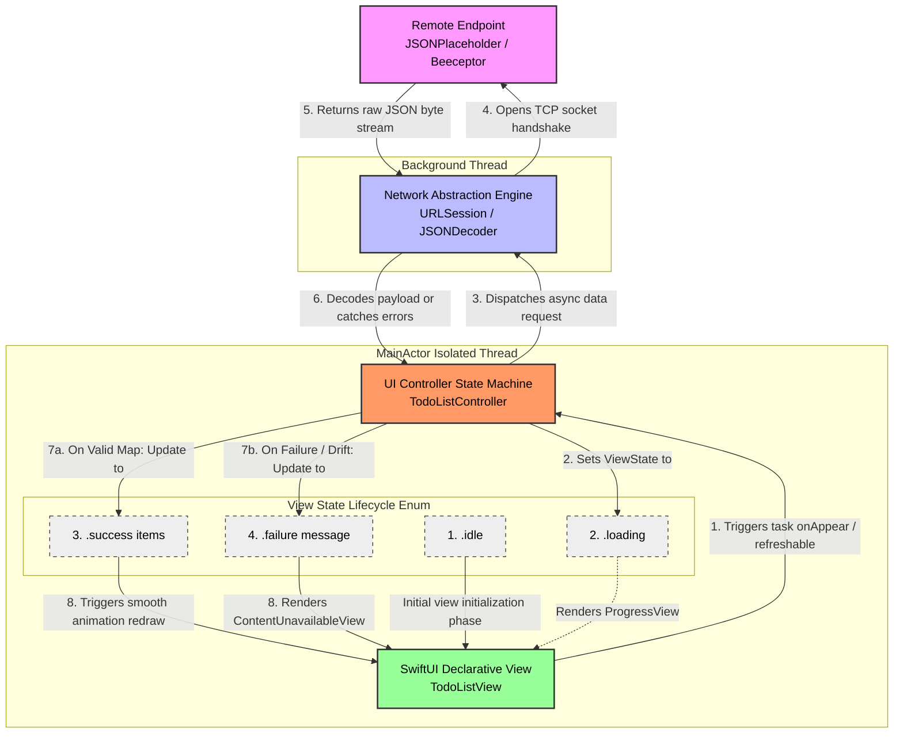

# Display API Data in SwiftUI

## Data Flow in Async Network Architectures

Connecting a remote network abstraction layer to a local user interface requires a structured, unidirectional data pipeline. Passing raw JSON buffers or unchecked model structures directly into visual rendering layers creates fragile view states and introduces visual artifacts during layout rendering.

To maintain predictable interfaces, data must pass through distinct lifecycle phases before updating state containers. The system coordinates state transitions across background execution tasks to the view container using a modern, actor-isolated observation model.



---

## Architectural State Management

A production network display layer must account for the fact that remote transactions take time and can fail. A view shouldn't simply toggle between displaying data and displaying nothing. It should explicitly represent the precise lifecycle phase of the active network operation using an enum-driven state pattern:

- **Idle / Initializing:** The structural container has initialized, but the network request has not yet been pushed into the execution thread queue.
- **Loading:** Sockets are open, and data is actively transferring across network boundaries. The interface displays localized placeholder elements (e.g., progress views) while blocking duplicate submissions.
- **Success:** The data buffer has been parsed into local memory structures. The view renders the populated model using high-performance collections.
- **Failure:** The stack intercepted an issue at the transport, protocol, or application layer. The view intercepts the specific error type and displays readable recovery instructions rather than crashing.

---

## Implementation: Core API Display Layer

The production-grade implementation below demonstrates a protocol-driven data transaction model feeding into a `MainActor`-bound state controller, which drives a responsive SwiftUI collection view.

```swift
import SwiftUI

// MARK: - Data Layer
/// Local data model representing individual todo items downloaded from the mock server cluster.
struct TodoItem: Identifiable, Decodable {
    let id: Int
    let userId: Int
    let title: String
    let completed: Bool
}

// MARK: - Controller Layer
/// Bounded view engine translating remote transactions into explicit UI state models.
@MainActor
@Observable
final class TodoListController {
    
    /// Explicit operational phases capturing the current network lifecycle state.
    enum ViewState {
        case idle
        case loading
        case success(items: [TodoItem])
        case failure(message: String)
    }
    
    // Controlled structural state exposed to tracking views
    private(set) var currentState: ViewState = .idle
    
    private let session: URLSession
    
    /// Initializes the view engine with configurable network sessions for testing isolation.
    init(session: URLSession = URLSession.shared) {
        self.session = session
    }
    
    /// Coordinates async execution loops to pull payloads from remote targets.
    func loadRemoteContent() async {
        // Prevent interface stuttering by ensuring we do not double-fetch active tasks
        if case .loading = currentState { return }
        
        currentState = .loading
        
        guard let fetchURL = URL(string: "https://jsonplaceholder.typicode.com/todos") else {
            currentState = .failure(message: "The application generated an invalid network route configuration.")
            return
        }
        
        do {
            // Execute non-blocking network socket data stream tracking
            let (data, response) = try await session.data(from: fetchURL)
            
            guard let httpResponse = response as? HTTPURLResponse else {
                currentState = .failure(message: "The server tracking response could not be interpreted.")
                return
            }
            
            // Validate protocol success codes before parsing memory records
            guard (200...299).contains(httpResponse.statusCode) else {
                currentState = .failure(message: "Remote server returned an operational failure code: \(httpResponse.statusCode)")
                return
            }
            
            // Extract the byte buffer into structured local memory layouts
            let decoder = JSONDecoder()
            let parsedItems = try decoder.decode([TodoItem].self, from: data)
            
            // Apply updates smoothly across the UI state binding layout
            withAnimation(.easeInOut(duration: 0.25)) {
                self.currentState = .success(items: parsedItems)
            }
            
        } catch let parsingError as DecodingError {
            currentState = .failure(message: "Data layout mismatch discovered during structural processing: \(parsingError.localizedDescription)")
        } catch {
            currentState = .failure(message: "A transport layer failure blocked data retrieval: \(error.localizedDescription)")
        }
    }
}

// MARK: - View Layer
/// Declarative list interface updating layouts dynamically based on state transitions.
struct TodoListView: View {
    
    // Inject the controller isolated to the Main Rendering Thread
    @State private var controller = TodoListController()
    
    var body: some View {
        NavigationStack {
            Group {
                switch controller.currentState {
                case .idle:
                    Color.clear
                        .onAppear {
                            Task { await controller.loadRemoteContent() }
                        }
                        
                case .loading:
                    VStack(spacing: 12) {
                        ProgressView()
                            .controlSize(.large)
                        Text("Synchronizing data index...")
                            .font(.subheadline)
                            .foregroundStyle(.secondary)
                    }
                    
                case .success(let items):
                    List(items) { item in
                        HStack(alignment: .top, spacing: 14) {
                            Image(systemName: item.completed ? "checkmark.circle.fill" : "circle")
                                .font(.title3)
                                .foregroundStyle(item.completed ? .green : .secondary)
                                .imageScale(.medium)
                                .padding(.top, 2)
                            
                            VStack(alignment: .leading, spacing: 4) {
                                Text(item.title)
                                    .font(.body)
                                    .fontWeight(.medium)
                                    .foregroundStyle(.primary)
                                    .frame(maxHeight: .infinity, alignment: .leading)
                                
                                Text("Task Identifier: \(item.id) • User Profile: \(item.userId)")
                                    .font(.caption2)
                                    .monospacedDigit()
                                    .foregroundStyle(.tertiary)
                            }
                        }
                        .padding(.vertical, 4)
                        .listRowSeparatorTint(.gray.opacity(0.2))
                    }
                    .listStyle(.insetGrouped)
                    .refreshable {
                        // Provides native pull-to-refresh hook execution
                        await controller.loadRemoteContent()
                    }
                    
                case .failure(let errorMessage):
                    ContentUnavailableView {
                        Label("Synchronization Failed", systemImage: "wifi.exclamationmark")
                            .foregroundStyle(.red)
                    } description: {
                        Text(errorMessage)
                            .font(.subheadline)
                    } actions: {
                        Button {
                            Task { await controller.loadRemoteContent() }
                        } label: {
                            Label("Retry Connection", systemImage: "arrow.clockwise")
                                .padding(.horizontal, 8)
                        }
                        .buttonStyle(.borderedProminent)
                        .controlSize(.medium)
                    }
                }
            }
            .navigationTitle("Remote Infrastructure")
            .navigationBarTitleDisplayMode(.large)
        }
    }
}

// MARK: - Preview Structural Layout
#Preview {
    TodoListView()
}
```

---

## Architectural Mapping & Error Resolution Strategies

- **Thread Concurrency Guarding:** The `TodoListController` uses the `@MainActor` attribute. Because UI frameworks like SwiftUI require layout engine changes to run on the primary rendering thread, this attribute guarantees that all data state updates happen safely, preventing multi-threaded data corruption crashes.
- **Performance Optimization for Lists:** The layout maps individual array models to SwiftUI rows using the `Identifiable` protocol constraint. This unique ID allows the internal collection renderer to track specific row mutations, adjustments, and movements. This prevents the view from rebuilding the entire list when only a single item changes.
- **Handling UI Interactivity Profiles:** Integrating the `.refreshable` modifier on the success list structure maps the container directly to Swift's async/await task pipeline. The system automatically maintains the visual layout refresh indicator while the background task runs, dropping it cleanly when the controller finishes updating the data state.
