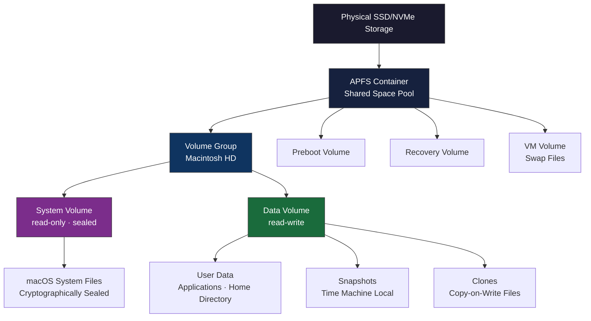

# APFS Structure Basics

## What is APFS?

Apple File System (APFS) replaced HFS+ as macOS's default file system in 2017 with macOS High Sierra. It was designed from the ground up for SSDs and flash storage, with first-class support for snapshots, clones, and strong encryption, features that HFS+ bolted on awkwardly over decades.

## Core Concepts

### Container

The top-level structure. A single APFS container occupies a partition and pools all its space into a shared allocation system. Multiple volumes within the same container share the container's total space dynamically, there are no fixed per-volume size limits.

### Volume

A logical partition within a container. Multiple volumes share the container's space pool. On a standard macOS installation, a single APFS container holds several volumes by default:

- **Macintosh HD:** the system volume (read-only, sealed)
- **Macintosh HD - Data:** the data volume (read-write)
- **Preboot:** bootloader data
- **Recovery:** macOS recovery environment
- **VM:** virtual memory swap files

### Volume Groups

The System and Data volumes are paired into a volume group and presented to the user as a single unified volume. The split between read-only System and read-write Data is a security measure introduced in macOS Catalina, it allows the system volume to be cryptographically sealed so any tampering is detectable at boot.

### Snapshots

Point-in-time read-only copies of a volume's state. APFS snapshots are space-efficient, they only store the delta between the snapshot and the current state, not a full copy. Time Machine on APFS uses local snapshots to enable browsing backup history without an external drive connected.

```bash
# List all APFS snapshots on the system volume
tmutil listlocalsnapshots /

# Create a snapshot manually
tmutil localsnapshot
```

### Clones

Copy-on-write file copies. When you duplicate a file on the same APFS volume, no data is actually copied, both the original and the clone reference the same underlying blocks. Data is only physically duplicated when one of the copies is modified. This makes `cp` on APFS nearly instantaneous for large files.

### Encryption

APFS supports per-volume and per-file encryption natively. FileVault on APFS encrypts the Data volume using the user's password-derived key. Individual files can also be encrypted independently of volume-level encryption.

## APFS Container Layout



## Useful Commands

```bash
# Show all APFS containers and volumes
diskutil list

# Show detailed APFS container info
diskutil apfs list

# Show space usage per volume in a container
diskutil apfs listContainers

# Show snapshot list for a volume
tmutil listlocalsnapshots /

# Delete old snapshots if disk space is low
tmutil deletelocalsnapshots YYYY-MM-DD-HHMMSS
```

## Why This Matters in Practice

- **Snapshots explain "disk full" surprises:** Time Machine local snapshots consume space that is not shown in Finder's used space calculation. If your disk appears nearly full despite deleting files, `tmutil listlocalsnapshots /` may reveal large snapshots that can be pruned.
- **Clones make duplication free:** duplicating large files in Finder is essentially free on APFS until you modify one of the copies.
- **The sealed system volume:** explains why you cannot modify system files even as root without disabling SIP. The seal is verified at boot and breaking it prevents the system from booting normally.
- **Volume group mounting:** explains why `df -h` shows Macintosh HD and Macintosh HD - Data as separate entries but Finder shows them as one.
