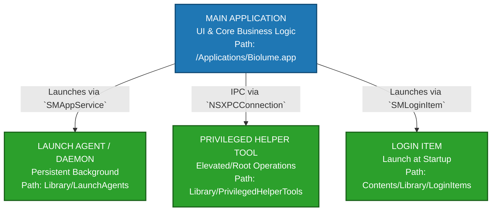

# Helpers, Login Items & Privileged Tools

## Architectural Overview

Modern macOS application architecture frequently decouples prolonged background tasks, elevated privilege operations, and startup routines from the primary user interface binary. This isolation ensures that if the main application UI crashes or hangs, vital background synchronization or system monitoring continues uninterrupted. This separation also minimizes the security attack surface by keeping the main UI sandboxed while isolating higher-privilege operations into dedicated sub-binaries.



## Comparative Architecture Matrix

| Metric                | Login Items (`SMLoginItem`) | Launch Agents (`SMAppService.agent`) | Launch Daemons (`SMAppService.daemon`) | Privileged Helpers (`SMJobBless`) |
| --------------------- | --------------------------- | ------------------------------------ | -------------------------------------- | --------------------------------- |
| **Execution Context** | User Session                | User Session                         | System-wide (Root)                     | System-wide (Root / Varied)       |
| **Lifecycle**         | Runs at login; UI helper    | Persistent or on-demand              | Runs at boot (persistent)              | On-demand via XPC call            |
| **Sandbox Status**    | Can be fully Sandboxed      | Typically un-sandboxed               | Un-sandboxed                           | Un-sandboxed                      |
| **Installation Path** | Inside Main App Bundle      | `~/Library/LaunchAgents`             | `/Library/LaunchDaemons`               | `/Library/PrivilegedHelperTools`  |
| **Authorization**     | None (User controllable)    | Explicit User Approval               | Admin Password Required                | Admin Password Required           |

---

## 1. Login Items (`SMLoginItem`)

Login Items are lightweight secondary application bundles embedded inside the main wrapper. Their primary function is to launch the main application automatically when the user logs into their macOS account, or to maintain a quiet menu-bar presence.

- **Location:** Must be placed inside the main application bundle at `Contents/Library/LoginItems/YourHelperApp.app`.
- **Management API:** Modern implementations leverage the `ServiceManagement` framework's `SMAppService.loginItem(identifier:)` to register and unregister the item programmatically.
- **TCC/Sandbox:** Login items respect standard user-level sandboxing constraints. They do not possess administrative capabilities.

---

## 2. Launch Agents and Daemons (`SMAppService`)

Launch Agents and Daemons provide background persistence independent of window visibility. They are managed directly by `launchd`.

- **Launch Agents:** Run on behalf of the currently logged-in user. They can communicate directly with the user session, display UI components, and access user-level hardware permissions (like the camera or microphone).
- **Launch Daemons:** Executed by the system as root before any user logs into the machine. Daemons are strictly headless processes; they cannot connect to the window server or display a GUI. Any interface interactions must be proxied to a companion agent or main application via an inter-process communication (IPC) channel.

### Implementation: Registering a Modern Background Agent

```swift
import Foundation
import ServiceManagement

struct ServiceManager {
    
    let agentService = SMAppService.agent(plistName: "com.example.backgroundagent.plist")
    
    /// Registers the background agent with launchd via the ServiceManagement framework.
    func registerBackgroundAgent() {
        do {
            try agentService.register()
            print("[+] Successfully registered background agent with launchd.")
        } catch {
            print("[-] Failed to register background agent: \(error.localizedDescription)")
            handleRegistrationFailure(error)
        }
    }
    
    /// Removes the background agent registration.
    func unregisterBackgroundAgent() {
        agentService.unregister { error in
            if let error = error {
                print("[-] Failed to unregister agent cleanly: \(error.localizedDescription)")
            } else {
                print("[+] Background agent unregistered successfully.")
            }
        }
    }
    
    private func handleRegistrationFailure(_ error: Error) {
        // Fallback diagnostics for enterprise deployments or localized profile restrictions
        let nsError = error as NSError
        if nsError.code == SMAppService.Error.operationNotSupported.rawValue {
            print("[-] ServiceManagement manipulation restricted by system policy or MDM profile.")
        }
    }
}
```

---

## 3. Privileged Helper Tools (`SMJobBless`)

When an utility needs to execute a task requiring root privileges, such as manipulating system-wide network sockets, editing structural configuration files, or managing low-level process tables, it should not run the entire UI application as root. Instead, it isolates those operations inside a dedicated tool installed via `SMJobBless`.

- **Security Requirements:** The helper tool binary and the main application must be securely signed. The `Info.plist` of the main app and the launchd configuration embedding of the helper must contain specific mutual code-signing requirements specifying exactly which signing identities are permitted to communicate.
- **Installation Mechanism:** `SMJobBless` prompts the user for an administrative password once. The system validates the signatures, copies the helper binary to the secure root directory `/Library/PrivilegedHelperTools/`, and writes a matching property list configuration to `/Library/LaunchDaemons/`.

---

## Communication Architecture: Inter-Process Communication (IPC)

Because these helper binaries run as separate operating system processes, they cannot share memory segments or global variables directly with the main user interface. Secure transmission of transactional data requires robust IPC.

The industry-standard approach on macOS is **NSXPCConnection**. This mechanism wraps low-level Mach ports in an object-oriented Swift wrapper, validating messages against an explicit protocol interface.

```swift
import Foundation

/// Protocol declaring the capabilities exposed by the high-privilege helper tool.
@objc protocol HelperToolProtocol {
    func executePrivilegedTask(command: String, withReply reply: @escaping (String, Error?) -> Void)
}

struct InterProcessBridge {
    
    /// Establishes an asynchronous XPC connection to the background helper service.
    func connectToHelper() -> NSXPCConnection {
        // 1. Initialize the connection using the helper's launchd service identifier
        let connection = NSXPCConnection(serviceName: "com.example.PrivilegedHelper")
        
        // 2. Configure the interface protocol so the connection knows how to serialize types
        connection.remoteObjectInterface = NSXPCInterface(with: HelperToolProtocol.self)
        
        // 3. Set up invalidation and interruption handlers for unexpected service crashes
        connection.interruptionHandler = {
            print("[-] XPC Connection interrupted. Mach port disrupted.")
        }
        
        connection.invalidationHandler = {
            print("[-] XPC Connection invalidated. Cleaning up system resources.")
        }
        
        // 4. Resume the connection to initiate the handshake over the Mach channel
        connection.resume()
        return connection
    }
    
    /// Dispatches an execution request to the helper tool over the active XPC tunnel.
    func dispatchTask(command: String) {
        let connection = connectToHelper()
        
        // Access the proxy object using an error handler block to prevent main-thread deadlocks
        let helper = connection.remoteObjectProxyWithErrorHandler { error in
            print("[-] Failed to safely acquire remote object proxy: \(error.localizedDescription)")
        } as? HelperToolProtocol
        
        helper?.executePrivilegedTask(command: command) { response, error in
            if let error = error {
                print("[-] Helper tool returned an operational error: \(error.localizedDescription)")
                return
            }
            print("[+] Privileged execution response received: \(response)")
        }
    }
}
```

## Security Pitfalls & Edge Cases

- **System Settings Visibility:** On modern macOS releases, all `SMAppService` agents, daemons, and login items are visible to the end-user under **System Settings > General > Login Items > Allow in Background**. Users can toggle these services off at will. Applications must design defensive runtime architecture that detects when their background services have been severed by checking service validity status on boot.
- **Orphaned Helper Remediation:** When upgrading an application that relies on an embedded helper tool, standard finder dragging will not clear old configurations out of `/Library/PrivilegedHelperTools/`. The application should handle self-version checks over XPC, prompting for an upgrade installation block if a mismatch between the master binary version and the tool string is detected.
- **XPC Message Validation:** Because root helpers accept external instruction lines, they must explicitly check the audit token (`NSXPCConnection.processIdentifier`) of incoming requests to ensure the calling process is legitimately the parent application, preventing local privilege escalation vulnerabilities.
